# How to Use Survival Analytics<br/>to Predict Employee Turnover

## (Or, Why You Shouldn't Use Logistic Regression to Predict Attrition)


### Talent Analytics, Corp.

#### Pasha Roberts, Chief Scientist

May 16, 2017   
San Francisco, CA  USA

<br/>
Demo Code: https://github.com/talentanalytics/class_survival_101/

---

# Who is Talent Analytics?


### Predictive Modeling Platform – Advisor™

- We predict employee attrition and performance pre-hire.
<br/><br/>
- Much like credit risk modeling:
  - Predict likelihood to pay / default on mortgage, **before** extending credit
  - Predict likelihood to perform / leave role or company early, **before** extending job offer
<br/><br/>
- PAAS (Prediction As A Service)
- Seamless deployment of predictions into talent acquisition process

---

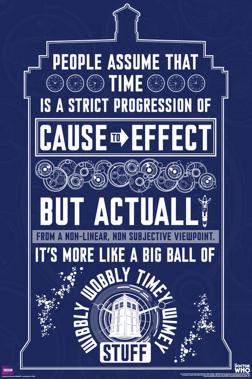

# Turnover and Tenure:
## A Timey-Wimey Relationship

---

# Two Different (But Related) Things

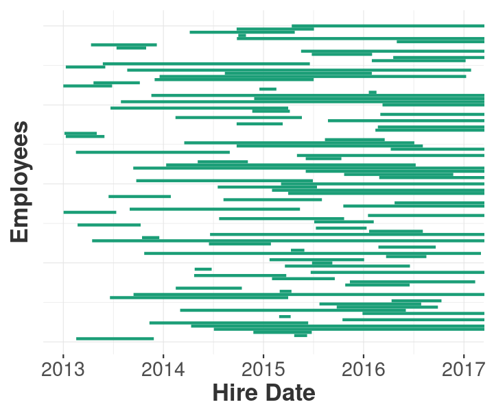

- **Turnover**: Percent of employees that terminate within a period of time
- **Tenure**: Employees’ length of time working at a role or company

### Is it a Wave or a Particle?

---

# Low Tenure, High Turnover

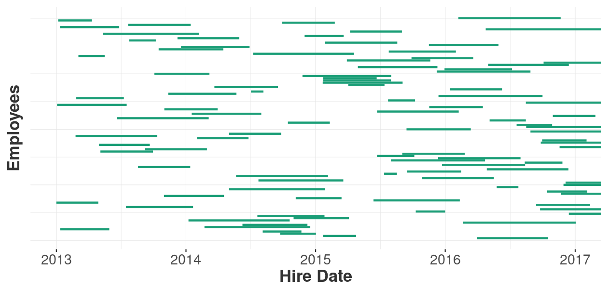

---

# High Tenure, Low Turnover

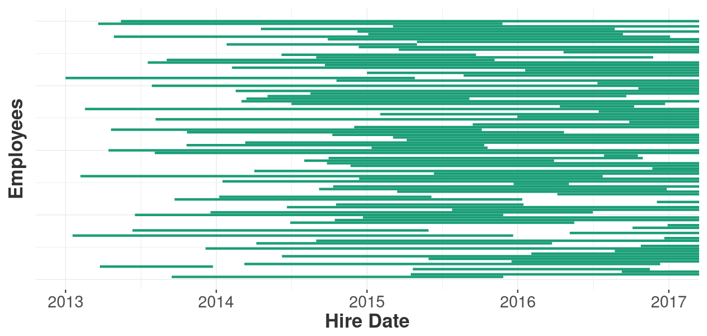

---

# High Tenure, High Turnover (in 2015)

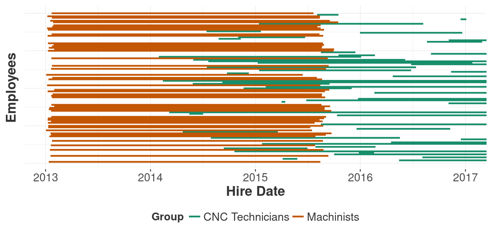

---

# Low Tenure, Low Turnover (in Nov, Dec)

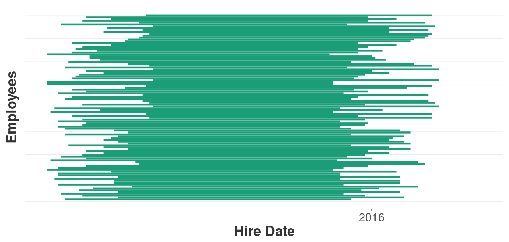

---

# Main Problem: We Can't See the Future

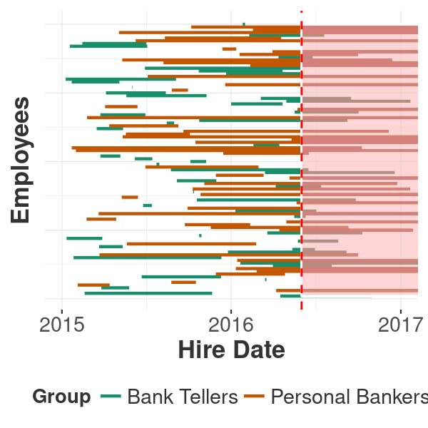

- Everyone will terminate.
- Someday, somehow... But when?
- Technical Lingo: **Right Censoring**

---

# Each Side Has Missing Information

### Turnover Has No Information About Tenure

- Treats a temp the **same** as a seasoned veteran
- Ignores patterns - such as people quitting right after a bonus

### Tenure Has No Information About Turnover

- High Tenure = staying power or retirement risk?

### Each Side Varies Depending on When You Look

---

# Annual Attrition Timing is Arbitrary

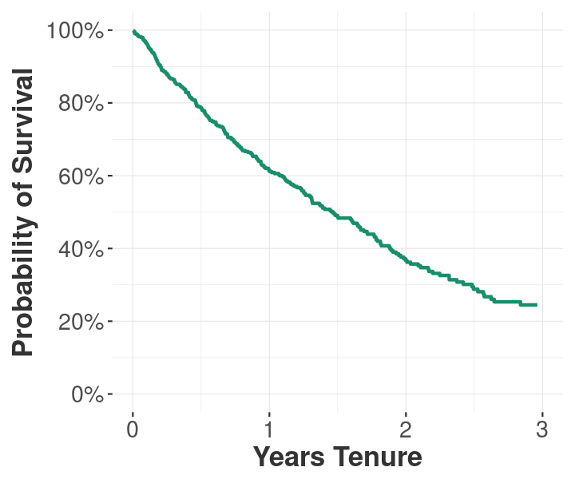

### What if you could see attrition<br/>at every point in time?

- "One Year" only matters to accountants and astronomers

- Cumulative Breakeven matters more to the business

---

# Survival 101

---

# Survival Analytics

- **Medical Roots** - How long will a patient survive a disease?
- **Engineering Roots** - How long until a machine fails?
- **Social Science** - How long do people live?
- **Employment** - How long until an employee terminates? or promotes?
<br/>
<br/>
- **In General** - "Expected duration of time until one or more events happen"
- Artfully combines turnover and tenure

> Lots of competing jargon and syntax from many application domains:   
> Failure Rate, Hazard Rate, Force of Mortality, ...

---

# Hazard Rate:<br/>Conditional Daily Risk of Termination

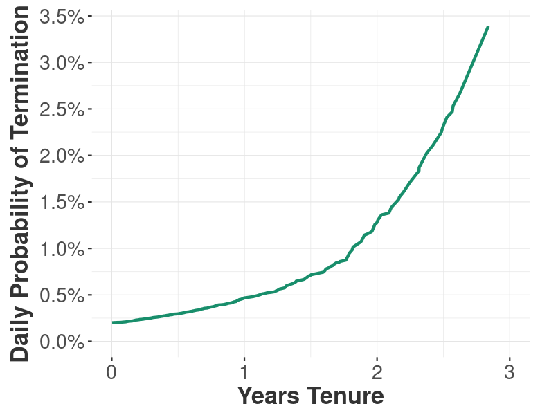

- Every day in tenure there is a (small) probability that the employee will terminate
- **Conditional on survival to the prior day**
<br/><br/>
- Like an actuarial life table
- Can rise at different times:<br/>e.g. training, review or bonus time

---

# Survival Rate: Daily Probability<br/>of Being Employed at Time *t*


- How likely are you to be working here,<br/>*t* days after being hired?
<br/><br/>
- Near 100% on Day 1<br/>(some people actually never show up)
- Downhill from there - usually not linear
- One role at a time
--
<br/><br/>
- *This* is the full picture
<br/><br/>
- Simple transformation of the Hazard Curve
  - Best to use statistical tool (R, SAS)
  - Apparently possible in Excel

---

# Attrition is Built Into Survival Curves

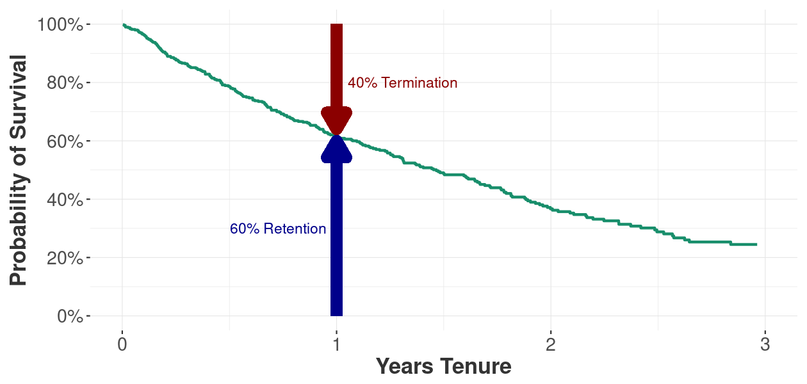

---

# Many Shapes

### Shelf Pattern
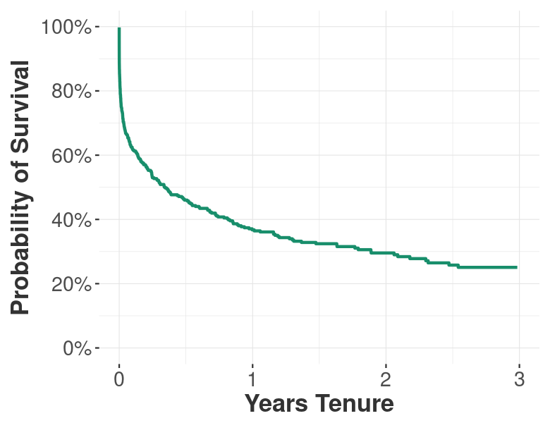

### Sparse Pattern
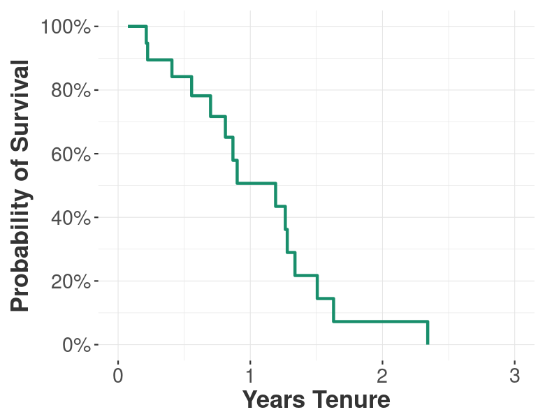

---

# Cliffs or Kinks in the Survival Curve

### Heavy Terms During Training
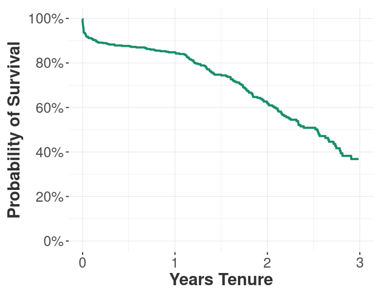

### Heavy Terms After 1-Year Bonus
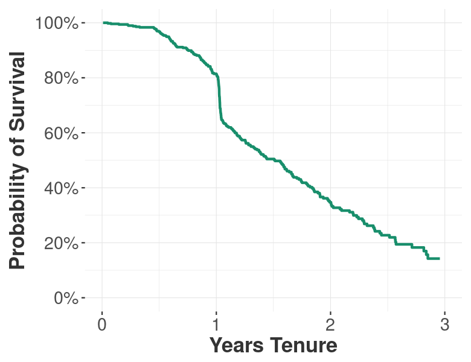

---

# Everyone Has a Survival Curve

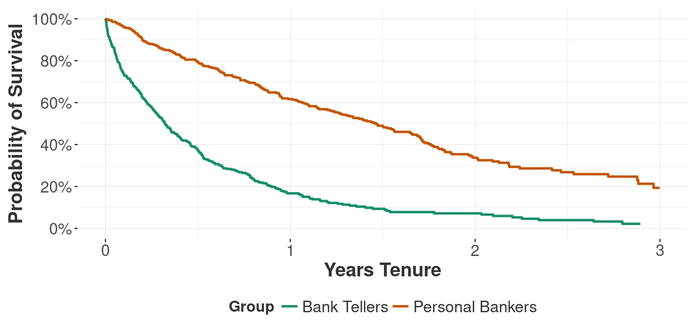

---


# Predicting Survival<br/>To the Individual Employee

---

# Don't Use Logistic Methods<br/>to Predict Attrition!


#### Commonly Done:
- Predict one-year attrition with logistic
- Use tenure as a variable along with others

#### Common Result:
- "The biggest cause of termination is tenure"
  - Not an actionable coefficient
- Ignores nuances available to survival methods
- Mishandles current employee tenure
- Less accurate

---

# Proportional Hazard

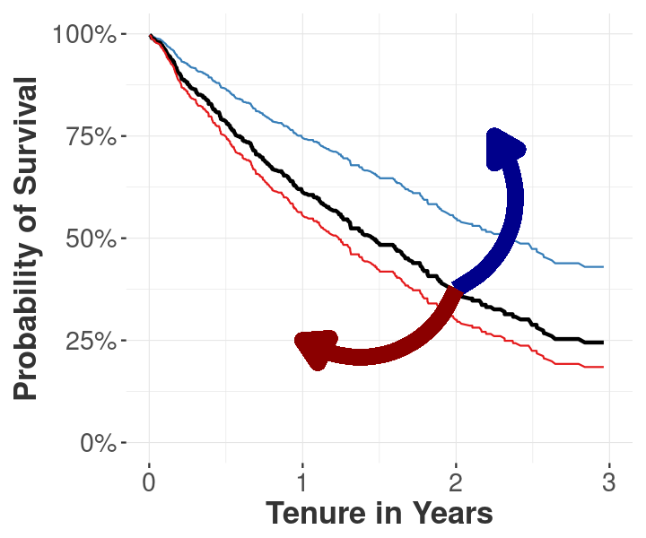

#### Most Survival models are "Proportional Hazard"
- Start with Base Survival rate
- Convert to Base Cumulative Hazard rate
<br/><br/>
- Multiply Cumulative Hazard by a single factor<br/>(hence "Proportional Hazard")
<br/><br/>
- Linear changes to Hazard lead<br/>to a *rotation* of Survival Curve

#### Predictive Goal: Predict the amount of Survival Curve<br/>rotation for each candidate

---

# Proportional Hazard Prediction Methods

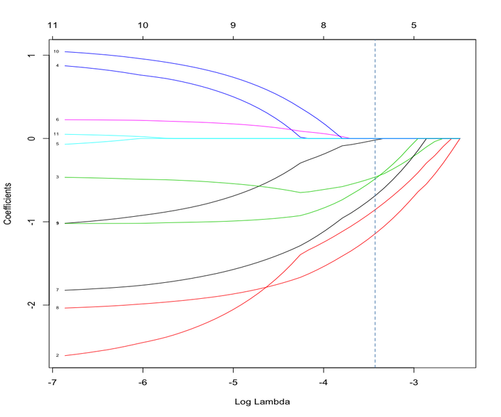

#### Predicting a Single Number
- Cox regression
  - Vanilla Cox
  - Stepwise
  - ElasticNet or LASSO
  - Variable selection with Random Forest
- Decision Trees
- Random Forests
- Neural Networks
- SVM, etc

#### There are also other survival algorithms,<br/>including parametric methods

---

# Build/Validate a Survival Model<br/>With Thresholds

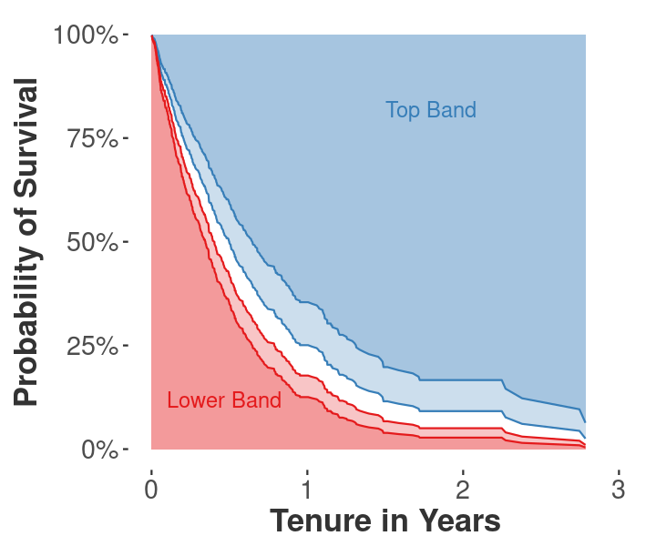

#### The Model Predicts:
- "Dark Blue" hires will survive the longest
- "Light Blue" hires will survive above-median
<br/><br/>
- "Grey" survival curve is current median survival.
<br/><br/>
- "Light Red" and "Dark Red" candidates are not likely to survive.

---


## Deeper Dive:

# Predicting Survival<br/>with Proportional Hazard

<br/><br/>

### Follow Demo Code on GitHub:

https://github.com/talentanalytics/class_survival_101/

---

# Formulas and Jargon

**Hazard Function:**  &nbsp;&nbsp; `\(h(t)\)`
- Probability of termination at time *t*, conditional on survival up to time t
- Ranges from 0 to 1 (typically very small)

**Cumulative Hazard Function:** &nbsp; `\(H(t) = \int_0^t \! h(x) \, \mathrm{d}x = -log(S(t))\)`
- Cumulative conditional probability of termination up to time *t*
- Ranges from 0 to 4ish (theoretically to Infinity)

**Survival Function:** &nbsp;&nbsp; `\(S(t) = e^{-H(t)}\)`
- Probability that termination will be later than time *t*
- Ranges from 1 to 0

#### Theoretically the formulas above are continuous measures, but in practice are discrete daily.

---

# Calculating Survival in R

### Four Simple Steps with R `survival` package:

1. Gather and Prepare the Data
2. Calculate Baseline Survival Function `\(S_0(t)\)`
3. Model Proportional Hazard with Cox Regression
4. Validate Model
--

<br/><br/>
5. Deploy Model into hiring
6. Hire people likely to stay on the job longer
7. Save and earn money
  - Avoid attributing savings to soft factors like ripple effect, morale, engagement
  - Hard savings from reduced Replacement Cost
  - Hard earnings from increased Employee Lifetime Value

---

# 1) Gather Employee Data

```r
> attr.data

  emp.id  hire.date  term.date   factor.x  factor.y factor.z
   <int>     <dttm>     <dttm>      <dbl>     <dbl>    <dbl>
1     52 2016-02-23       <NA> 0.09555369  1.515028 102.3811
2    261 2014-10-30       <NA> 2.40144024  9.065855 100.5727
*3    193 2013-12-25 2015-03-28 1.88463382  4.331642 105.6887
*4    150 2013-03-27 2013-09-19 3.81625316  7.363454 110.6842
5     31 2015-03-25       <NA> 5.17392728 11.824601 110.0590
```

#### Simple Requirements

- Just `hire.date` and `term.date` is all you need from HRIS
  - Leave `term.date` as `NA` if the employee haven't terminated yet
<br/><br/>
- Merge with predictive input (independent) variables
  - e.g. assessment results, experience, CV detail, social media, semantic
  - Here we use `factor.x`, `factor.y` and `factor.z`
  - Are these variables available pre-hire?

---

# Calculate Fields for Survival

```r
> attr.data %>% dplyr::select(-dplyr::contains("factor"))

  emp.id  hire.date  term.date is.term   end.date tenure.years
   <int>     <dttm>     <dttm>   <lgl>     <dttm>        <dbl>
1     52 2016-02-23       <NA>   FALSE 2017-05-01    1.1854894
2    261 2014-10-30       <NA>   FALSE 2017-05-01    2.5023956
*3    193 2013-12-25 2015-03-28    TRUE 2015-03-28    1.2539357
*4    150 2013-03-27 2013-09-19    TRUE 2013-09-19    0.4818617
5     31 2015-03-25       <NA>   FALSE 2017-05-01    2.1026694
```

#### Simple Derivations

- `is.term`: Have they terminated?  Is `term.date` NA?
- `end.date`: Either `term.date`, or censor date, depending on `is.term`
  - Could put `transfer.date` here with no `is.term`
  - *The last date we know the employee was at work*
- `tenure.years`: What is employee tenure from `hire.date` to `end.date`?
  - *All we know about the employee's tenure, as of censor date*


---

# Dataset is Ready

```r
> glimpse(attr.data)

Observations: 400
Variables: 14
$ label        <fctr> a, a, a, a, a, a, a, a, a, a, a, a, a, a, a, a, a, a,...
$ hire.date    <dttm> 2013-04-20, 2016-01-14, 2013-09-20, 2014-05-17, 2016-...
$ term.date    <dttm> NA, NA, NA, NA, NA, NA, NA, NA, NA, NA, NA, NA, 2016-...
*$ is.term      <lgl> FALSE, FALSE, FALSE, FALSE, FALSE, FALSE, FALSE, FALSE...
$ end.date     <dttm> 2017-05-01, 2017-05-01, 2017-05-01, 2017-05-01, 2017-...
*$ tenure.years <dbl> 4.02975576, 1.29469635, 3.61029191, 2.95626651, 1.1463...
$ factor.x     <dbl> 7.44846858, 1.08376058, 2.81983987, 0.56880027, 0.7868...
$ factor.y     <dbl> 16.838313, 9.335225, 9.519951, 12.697147, 12.912898, 1...
$ factor.z     <dbl> 103.10732, 100.37171, 99.76382, 95.88645, 97.61509, 10...
$ emp.id       <int> 1, 2, 3, 4, 5, 6, 7, 8, 9, 10, 11, 12, 13, 14, 15, 16,...
*$ scale.x      <dbl> 2.41351313, -0.24754913, 0.47829958, -0.46285224, -0.3...
*$ scale.y      <dbl> 1.31773198, -0.57718839, -0.53053544, 0.27187182, 0.32...
*$ scale.z      <dbl> 0.3407242, -0.1849069, -0.3017096, -1.0467221, -0.7145...
$ is.training  <lgl> TRUE, TRUE, TRUE, FALSE, FALSE, FALSE, TRUE, TRUE, TRU...
```

- Example is 400-row simulated dataset
- Scaled the input factors to consistent z-scale
- Separated into 80% training and 20% validation datasets

---

# 2) Calculate Baseline Survival (`\(S_0(t)\)`)

#### `survival::Surv` is a single object to hold Tenure and Turnover at once

```r
*> surv.obj <- survival::Surv(training.data$tenure.years, training.data$is.term)
```

- Needs "time variable" `tenure.years` and "event variable" `is.term`

#### `survival::survfit` is the Kaplan-Meier Estimator of `\(S_0(t)\)`

```r
*> surv.fit <- survival::survfit(surv.obj ~ 1)
> summary(surv.fit)
Call: survfit(formula = surv.obj ~ 1)

  time n.risk n.event survival std.err lower 95% CI upper 95% CI
 0.000    320       1    0.997 0.00312        0.991        1.000
 0.249    308       1    0.994 0.00448        0.985        1.000
 0.298    303       1    0.990 0.00554        0.980        1.000
 0.320    298       1    0.987 0.00644        0.974        1.000
```


---

# Plot Baseline Survival

### Native Survival Plot
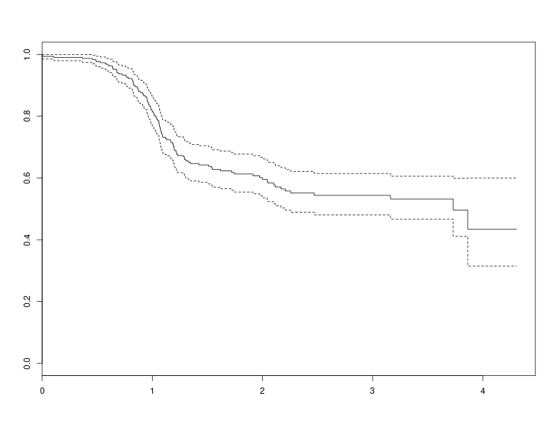

### Crafted ggplot2 Plot
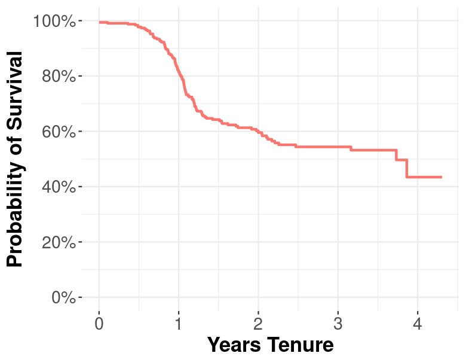

---

# 3) Back to Proportional Hazard


#### Consider a multiplier *x* that centers on 1
- Multiply `\(H_x(t) = H_0(t) x \)`<br/>for proportional (linear) changes to Hazard
- Survival Curve **rotates** in response: `\(S_x(t) = e^{-H_0(t) x} \)`

#### Beware - inverse relationship:
- *x* ← 1.1  will increase `\(H_x(t)\)`, decrease `\(S_x(t)\)`
- *x* ← 0.9 will decrease `\(H_x(t)\)`, increase `\(S_x(t)\)`

#### So we just need to predict *x* to predict Survival
- One number drives the entire curve, based on baseline `\(H_0(t)\)`

---

# Model Proportional Hazard<br/>with Cox Regression

```r
*> cox.model <- survival::coxph(formula = surv.obj ~ scale.x + scale.y + scale.z,
*                              data = training.data)

> cox.model

Call:
survival::coxph(formula = surv.obj ~ scale.x + scale.y + scale.z,
    data = training.data)

           coef exp(coef) se(coef)     z         p
*scale.x -0.4298    0.6506   0.0918 -4.68 0.0000028
*scale.y -0.3204    0.7258   0.0957 -3.35   0.00082
*scale.z -0.1967    0.8215   0.0984 -2.00   0.04558

Likelihood ratio test=38.2  on 3 df, p=0.000000025
n= 320, number of events= 125
```

---

# 4) Predict `validation.data`<br/>with New Cox Model

```r
*> cox.pred <- predict(cox.model, newdata = validation.data, type = "lp")
```

- Note: we built model with `training.data`, now we predict against `validation.data`
  - Our model has never seen anything in `validation.data`
  - Great test to see how closely our predictions match known outcomes
<br/><br/>
- The `predict.coxph()` function returns 5 different types of predictions
  - We want `type = "lp"` which is `log(multiplier)` to baseline `\(H_0(t)\)`
  - Other types won't work with `survivalROC()`

---

# How does ROC Work with Survival?

```r
*> roc.obj <- survivalROC::survivalROC(Stime = validation.data$tenure.years,
*                                    status = validation.data$is.term,
*                                    marker = cox.pred,
*                                    predict.time = 1,
*                                    lambda = 0.003)

> roc.obj$AUC
[1] 0.7102442
```

#### ROC typically evaluates classification methods
- So, we make this a classification problem
- **Classify:** Was the employee terminated at `t = 1` or not?
- Compare actual vs. predicted classifications at all cutpoints

#### Our AUC is 0.71
- Not bad for a censored attrition prediction!

---

# Plot AUC with `ggplot2`


---

# Don't Get Fooled by Randomness

### We are predicting AUC, too

- Let's try predicting 1000 random samples of the same underlying pattern

```r
> test.repl <- replicate(1000, demoPrediction(verbose = FALSE))

> summary(test.repl)
   Min. 1st Qu.  Median    Mean 3rd Qu.    Max.
 0.3470  0.6191  0.6833  0.6771  0.7356  0.9446
```

- AUC generally fell between 0.619 and 0.735, but 50% were outside this range
- The likely AUC is closer to 0.68 - still good
- What if you got a **lucky** (or unlucky) 80/20 validation split?

---

# Multiple Cross-Validation

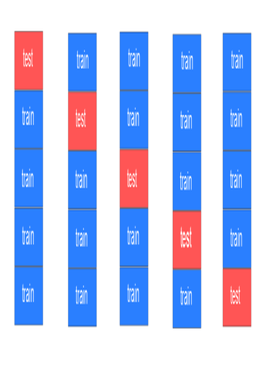

### Raises the Bar<br/>Against Getting Fooled

- Typically run 20-100 CV iterations
- Can consume lots of core-hours if nested for hyperparameters

---

# Download and Experiment With this Code


- These slides will be on PAW website
<br/><br/>
- Download demo code and doc from https://github.com/talentanalytics/class_survival_101/
<br/><br/>
- Clone it, fork it, run it
- Send bug fixes
- Let me know how it goes

---

# Questions and Discussion

### Pasha Roberts

#### pasha@talentanalytics.com

### Follow Demo Code on GitHub:

https://github.com/talentanalytics/class_survival_101/

